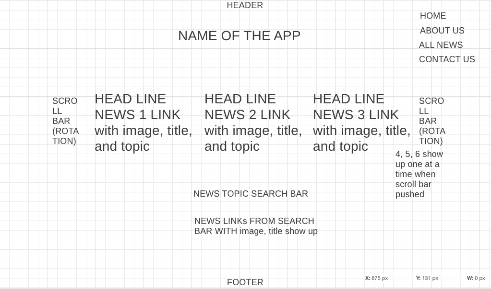
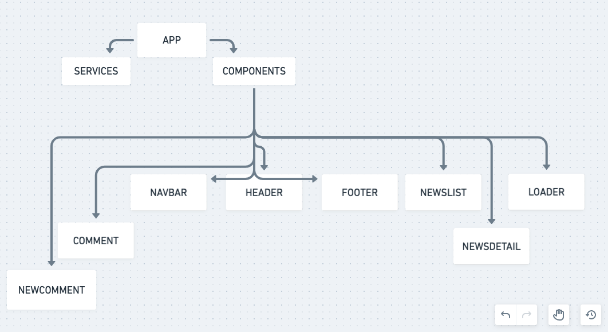

# Project Overview

## Project Name

NEWS STREAMING WEBSITE

## Project Description

The website that I will be creating for this second project will allow users to search news by topic and receive the links for related news. This website will enable user to post and edit the comment for each news. This website will also list out all the news by topics. In addition, it will present highlighted news on the homepage and let the user to scroll to look through.

## Wireframes




## Component Hierarchy



## API and Data Sample

https://airtable.com/tblWqLsYeGt9B13wJ

```
{
    "records": [
        {
            "id": "recfbCkioXk7906iL",
            "fields": {
                "title": "test",
                "briefdesc": "test",
                "image": "test",
                "author": "test",
                "topic": "test",
                "link": "test"
            },
            "createdTime": "2021-07-13T17:20:01.000Z"
        },
        {
            "id": "recaMy5KRvVx7ywkz",
            "fields": {},
            "createdTime": "2021-07-13T17:20:01.000Z"
        },
        {
            "id": "recfhhZlWS2V9uLxO",
            "fields": {},
            "createdTime": "2021-07-13T17:20:01.000Z"
        }
    ],
    "offset": "recfhhZlWS2V9uLxO"
}
```

#### MVP

- UTILIZING REACT COMPONENTS PROPERLY.
- USE AXIOS TO CONSUME DATA FROM AIRTABLE, AND RENDER THAT DATA IN MY COMPONENTS.
- USE AXIOS TO POST NEW DATA ON AIRTABLE


#### PostMVP  
- CREATE A 2ND HEADER THAT DISPLAYS MAJOR STOCK OR CURRENCY INFO
like the one in Wallstreetjournal.
- MAKE 'KOREAN' VERSION AVAILABLE.

## Project Schedule


|  Day | Deliverable | Status
|---|---| ---|
|July 10-12| Prompt / Wireframes / Priority Matrix / Timeframes |Complete
|July 13| Project Approval | Complete
|July 13| Core Application Structure (HTML, CSS, etc.) | Complete
|July 14| Pseudocode / actual code | Complete
|July 15| Initial Clickable Model  | Complete
|July 16| MVP | Complete
|July 17-19| POSTMVP /WRAPUP | Complete
|July 20| Presentations | Complete

## Timeframes

| Component | Priority | Estimated Time | Time Invested | Actual Time |
| --- | :---: |  :---: | :---: | :---: |
| CORE APP STRUCTURE(HTML,CSS,JAVASCRIPT) | H | 3hrs| 3hrs | 3hrs |
| Working with AIRTABLE | H | 3hrs| 3hrs | 3hrs |
| PSEUDOCODE | H | 3hrs| 2hrs | 2hrs |
| AIRTABLE API REQUEST | H | 3hrs| 3hrs | 3hrs |
| CREATE REACT FUNCTIONS | H | 3hrs| 3hrs | 3hrs |
| STYLE CSS | H | 3hrs| 4hrs | 4hrs |
| ROUTE AND LINK | H | 3hrs| 3hrs | 3hrs |
| AXIOS | H | 2hrs| 2hrs | 2hrs |
| NEW COMMENT | H | 3hrs| 3hrs | 3hrs |
| COMMENT STYLE | H | 3hrs| 3hrs | 3hrs |
| NAVBAR | H | 2hrs| 2hrs | 2hrs |
| DEBUGGING | H | 3hrs| 3hrs | 3hrs |
| DEPLOYMENT | H | 3hrs| 3hrs | 3hrs |
| Total | H | 40hrs| 37hrs | 37hrs |

## SWOT Analysis

### Strengths: I am getting familiar with fetching external API data. I also learned how to do better css styling especially for media queries. During my project 1, I was so confused and behind all the materials I learned. So, I could not really decorate my website and add helpful and creative features. But, I am glad I am getting used to javascript more than before and now have courage to attempt some advanced skills.


### Weaknesses: While I learned a lot about CSS styling, I also realize I still need more practices with it. I am also still struggling with makinng comment section, especially the place where comments are posted. I was searching how to make delete function and found there are several ways to do it, but most were written in component function, which I am not familiar with and not familiar to convert it to regular function. So, I realize that I need to be more familiar with how to write component function and how to convert it to regular javascript function way.

### Opportunities: This project gave me an opportunity to apply all the knowledge and skills learned throughout the Unit 2. In addition, I had great opportunities to practice materials learned from Unit 1.

### Threats: Overall, I still need a lot of practices. I will not be able to create a usable website without referring to the sample codes that instructors provided. I know I do not need to memorize everything, but I still need to get familiar with all those materials I learned so that I can freely and confidently use them or debug.
