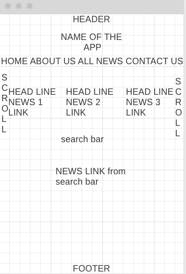

# Project Overview

## Project Name

NEWS STREAMING WEBSITE

## Project Description

The website that I will be creating for this second project will allow users to search news by topic and receive the links for related news. 

## Wireframes

## Component Hierarchy

## API and Data Sample

### MVP/PostMVP

The functionality will then be divided into two separate lists: MVP and PostMVP.  Carefully decide what is placed into your MVP, as the client will expect this functionality to be implemented upon project completion.  

#### MVP

- UTILIZING REACT COMPONENTS PROPERLY.
- USE AXIOS TO CONSUME DATA FROM AIRTABLE, AND RENDER THAT DATA IN MY COMPONENTS.
- USE AXIOS TO POST NEW DATA ON AIRTABLE

#### PostMVP  
- CREATE A 2ND HEADER THAT DISPLAYS MAJOR STOCK OR CURRENCY INFO
like the one in Wallstreetjournal.
- MAKE 'KOREAN' VERSION AVAILABLE.

## Project Schedule

This schedule will be used to keep track of your progress throughout the week and align with our expectations. Here's an example.

|  Day | Deliverable | Status
|---|---| ---|
|July 10-12| Prompt / Wireframes / Priority Matrix / Timeframes | Incomplete
|July 13| Project Approval | Incomplete
|July 13| Core Application Structure (HTML, CSS, etc.) | Incomplete
|July 14| Pseudocode / actual code | Incomplete
|July 15| Initial Clickable Model  | Incomplete
|July 16| MVP | Incomplete
|July 17-19| POSTMVP /WRAPUP | Incomplete
|July 20| Presentations | Incomplete

## Timeframes

Tell us how long you anticipate spending on each area of development. Be sure to consider how many hours a day you plan to be coding and how many days you have available until presentation day.

Time frames are also key in the development cycle.  You have limited time to code all parts of your app.  Your estimates can then be used to evalute possibilities based on time needed and the actual time you have before the app must be submitted. It's always best to pad the time by a few hours so that you account for the unknown so add an additional hour or two to each component to play it safe. Throughout your project, keep track of your Time Invested and Actual Time and update your README regularly.

| Component | Priority | Estimated Time | Time Invested | Actual Time |
| --- | :---: |  :---: | :---: | :---: |
| CORE APP STRUCTURE(HTML,CSS,JAVASCRIPT) | H | 3hrs| hrs | hrs |
| Working with AIRTABLE | H | 3hrs| hrs | hrs |
| PSEUDOCODE | H | 3hrs| hrs | hrs |
| AIRTABLE API REQUEST | H | 3hrs| hrs | hrs |
| CREATE REACT FUNCTIONS | H | 3hrs| hrs | hrs |
| STYLE CSS | H | 3hrs| hrs | hrs |
| ROUTE AND LINK | H | 3hrs| hrs | hrs |
| AXIOS | H | 2hrs| hrs | hrs |
| USEHISTORY, USEPARAM | H | 2hrs| hrs | hrs |
| LOADER | H | 1hrs| hrs | hrs |
| NEW COMMENT | H | 3hrs| hrs | hrs |
| EDIT COMMENT | H | 3hrs| hrs | hrs |
| NAVBAR | H | 2hrs| hrs | hrs |
| DEBUGGING | H | 3hrs| hrs | hrs |
| DEPLOYMENT | H | 3hrs| hrs | hrs |
| Total | H | 40hrs| hrs | hrs |

## SWOT Analysis

### Strengths:

### Weaknesses:

### Opportunities:

### Threats:
